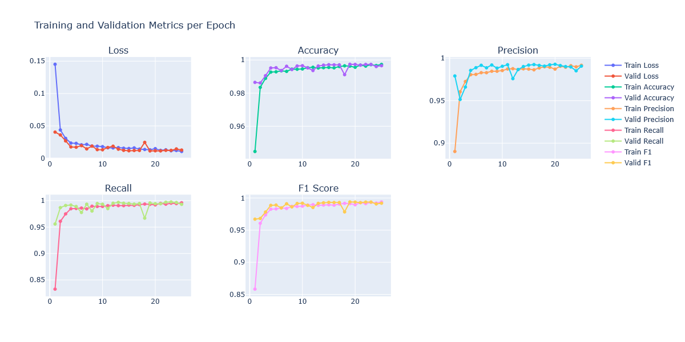
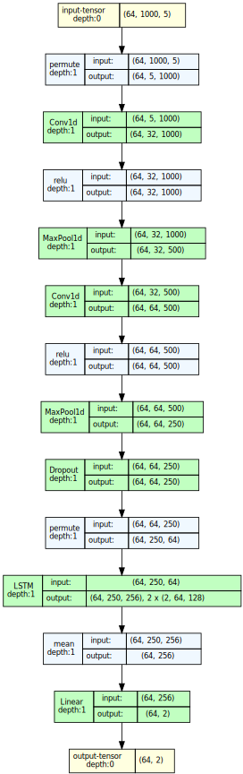

# ParaPerk Sequence Classifier

A deep learning model for classifying DNA sequences as either Paramoeba or Perkinsela in a joint contigs metagenome.

## Model Overview

This project implements a hybrid **CNN-LSTM** architecture to **classify DNA sequence fragments from a metagenome containing both Paramoeba and Perkinsela species**. The model processes DNA sequence fragments of 1000 nucleotides and predicts their taxonomic classification with high accuracy (**Figure 1**).

The key results achieved on the 25th epoch:
*Table 1. Key performance metrics*
| Metric | Train | Validation |
| :--: | :--: | :--: |
| Loss | 0.010 | 0.012 |
| Accuracy (%) | 99.74 | 99.66 |
| Precision (%) | 99.17 | 99.07 |
| Recall (%) | 99.59 | 99.31 |
| F1 (%) | 99.38 | 99.19 |

*Figure 1. Results for loss, accuracy, precision, recall and f1 score for training and validation modes over 25 epochs.*

## Architecture

The model employs a hybrid approach with convolutional layers for feature extraction followed by bidirectional LSTM for sequence modeling as shown at **Figure 2**.

*Figure 2. ParaPerk Classifier Simplified Architecture*

* Input layer accepting DNA sequences encoded as 5-feature vectors (4 for nucleotides + 1 for low complexity flag)
* Two convolutional layers with max pooling for local feature extraction
* Dropout layer (0.3) for regularization
* Bidirectional LSTM layer for sequence modeling
* Final linear layer for classification

The architecture processes the input data in batcher (64, 1000, 5) through multiple transformations:

1. Permute operation to reorder dimensions for CNN processing
2. Two Conv1D + ReLU + MaxPool1D blocks to extract features
3. Dropout for regularization
4. Second permute operation to prepare for sequence modeling
5. Bidirectional LSTM to capture context in both directions
6. Mean pooling along the sequence dimension
7. Linear layer for final classification

## Performance Results

After 25 epochs of training, the model achieved excellent performance metrics (**Table 1**).

**Performance on Minor Class:**

Despite the class imbalance (Paramoeba 85%, Perkinsela 15%), the model
performed exceptionally well on both classes. The consistently high
precision (99.07%), recall (99.31%), and F1 score (99.19%) on the
validation set indicate that the model correctly classified both the
majority and minority classes

**.**

The high recall value is particularly important as it
shows the model's ability to identify the less frequent Perkinsela
sequences correctly. This is further supported by the stable and high
metrics throughout the final epochs, demonstrating the model's
robustness

**.**

## Training Process

The training process showed a typical and healthy learning curve:

1. **Initial Phase (Epochs 1-5):**
   * Rapid decrease in loss
   * Quick improvement in accuracy, precision, recall, and F1 scores
2. **Middle Phase (Epochs 6-15):**
   * Continued gradual improvement
   * Stabilizing metrics with minor fluctuations
3. **Final Phase (Epochs 16-25):**
   * Consistent high performance
   * Very stable metrics across all evaluation criteria

The validation metrics closely tracked the training metrics, suggesting good generalization without overfitting

**.**

## Implementation Details

**Data Processing:**

* DNA sequences were fragmented into 1000-nucleotide chunks
* Each nucleotide was converted to a 5-dimensional feature vector:
  * 4 dimensions for one-hot encoding (A, C, G, T)
  * 1 dimension for complexity information (uppercase/lowercase)
* Data was split into training (80%) and validation (20%) sets with stratification to maintain class distribution

**Training Configuration:**

* Batch size: 64
* Optimizer: Adam with learning rate 1e-3
* Loss function: CrossEntropyLoss
* Training for 25 epochs

## Conclusion

The hybrid CNN-LSTM architecture proved highly effective
 for classifying metagenomic contigs between Paramoeba and Perkinsela.
Despite the class imbalance, the model achieved excellent performance
metrics across both classes, demonstrating its potential for accurate
taxonomic classification in metagenomic datasets

**.**

The high precision and recall values indicate that the
model can reliably distinguish between these organisms, making it a
valuable tool for analyzing joint contigs metagenomes containing these
species.
